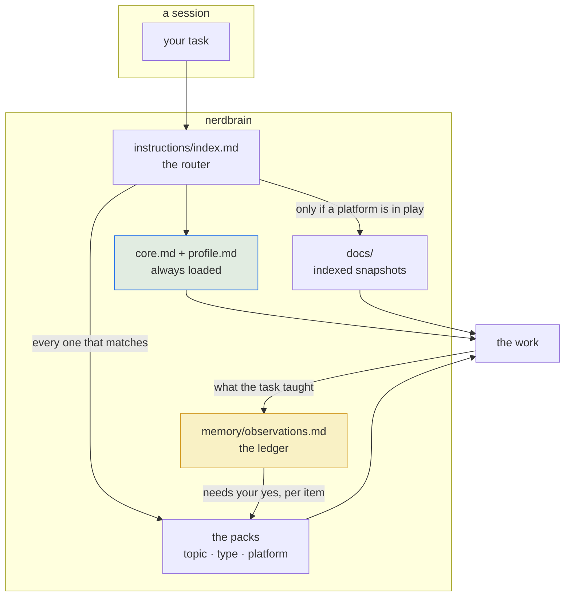
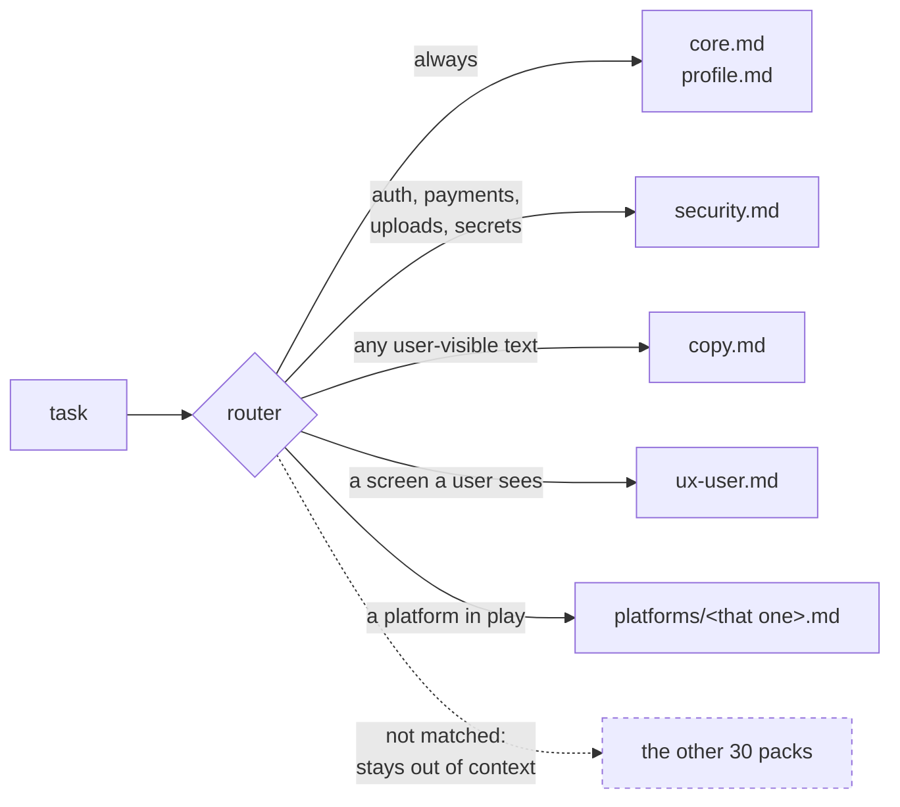
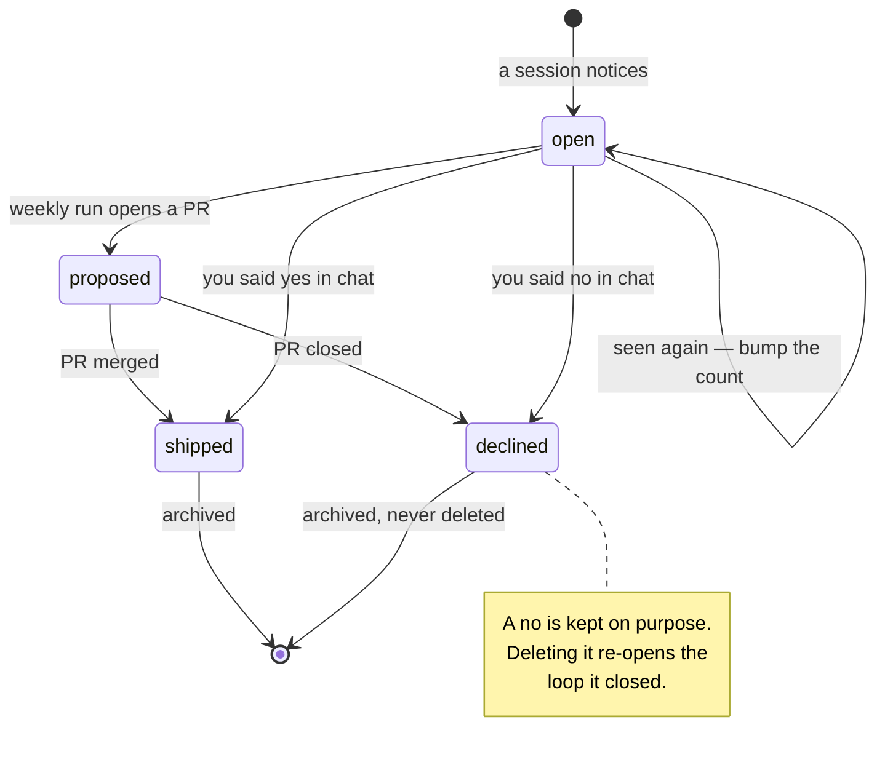
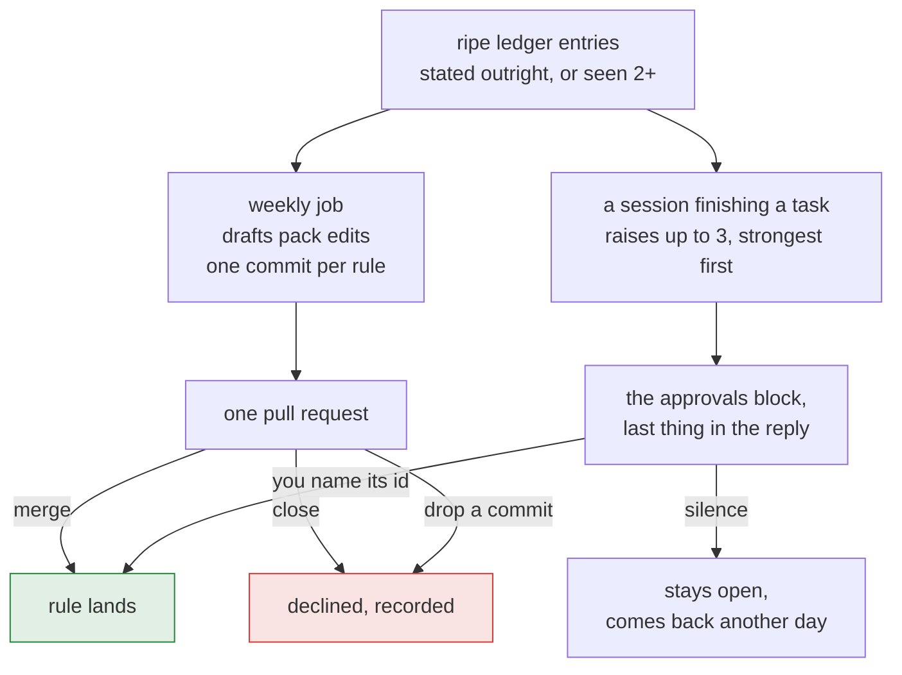
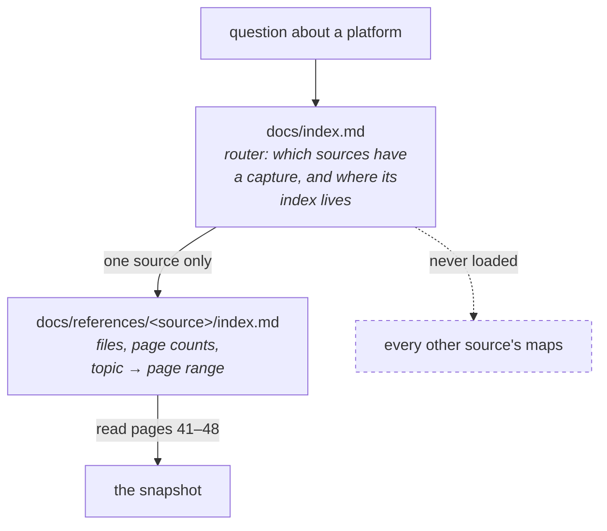
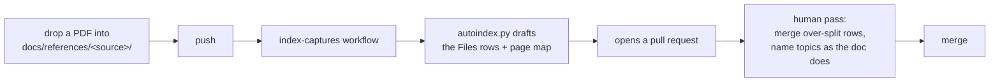
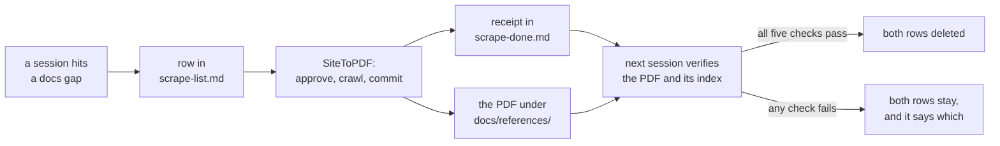
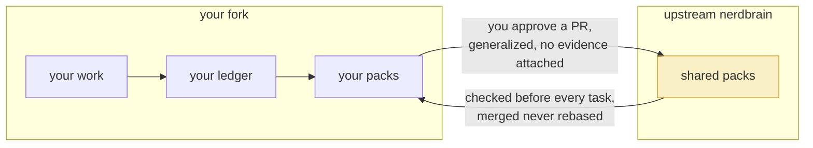

# How nerdbrain works

Five mechanisms. Each one exists because a simpler version of it failed in a specific way,
and each is stated here with that failure attached — a mechanism whose reason is missing gets
"simplified" back into the thing it replaced.

1. **Routing** — the agent loads the packs the task needs, not all forty.
2. **The ledger** — lessons get recorded without needing anyone's permission.
3. **The approval gate** — lessons become rules only when you say so, per item.
4. **The doc index** — six pages of a vendor PDF instead of a guess from memory.
5. **The consistency gate** — the invariants the other four rest on, checked by CI.

---

## The shape of the whole thing



Two arrows carry the whole design. The one into the packs is **selective** — that is what
keeps context cheap. The one out of the work into the ledger is **unconditional** — that is
what stops knowledge dying with the session.

---

## 1. Routing

### What it replaces

One long standing-instructions file. The failure is well known and boring: past a certain
length the file is partly ignored, so people stop adding to it, so it stops describing how
they actually work.

### How it works

`instructions/index.md` is a table from task shape to packs. The agent reads it, loads what
matches, and skips the rest.



Three rules make it hold:

- **Re-route at every task, and every iteration of one.** Not only when the work changes
  kind. The router is already in context, so the check is free, and the delta rule below
  means most checks load nothing.
- **Read the delta, never the set.** A pack already in context is still in force. Re-reading
  it costs context and buys nothing.
- **Load every match, all of it.** There is no count to hit. The minimum that covers the
  work is the target, and a pack dropped to keep a number down takes its rules with it. The
  economy is in not reading what the router didn't match.
- **Precision replaces the cap.** A match means the task actually does this thing, not that
  it plausibly might — and a pack is loaded when the work reaches it, not up front in case.
  That is what keeps context cheap once counting stops.

### Precedence

Conflicts resolve one way, always: **specific beats general, and you beat everything.**

```
what you said in this conversation
  > the project's own CLAUDE.md and existing conventions
    > platform pack  >  type pack  >  topic pack  >  core.md
      > the agent's defaults
```

A pack never quietly overrides something said in conversation. If a pack disagrees with how
the project already does it, the project wins and the agent says so in one line.

---

## 2. The ledger

### What it replaces

Asking for approval at the moment of noticing. That failed three ways at once: an
observation made to someone who had stepped away was simply lost; a first sighting could
never become a second, because nothing survived to be counted; and a rule declined in March
came back in June as if new.

### The separation that makes it work

**Recording and approving are two different acts.**

| | Recording | Approving |
|---|---|---|
| Where | `memory/observations.md` | a pack under `instructions/` |
| Changes behavior | No | Yes |
| Needs permission | **No** | **Yes, per item** |
| Who may do it | any session, unprompted | you, explicitly |

An entry in the ledger governs nothing. That is exactly why writing one is free — and why
an agent that reads an `open` entry and acts on it has skipped the gate the whole system is
built around.

### The entry

```
### obs-0042 — 2026-08-12
- **Observation:** One sentence, imperative, generalized past the project that produced it.
- **Rests on:** seen once (2026-08-12)
- **Target:** ../instructions/shipping.md
- **Status:** open
```

**Rests on** is the field that makes the ledger worth having. `stated outright`, `seen
once`, or `seen N times`, each with dates. It is the difference between a guess and a case,
and it is what the promotion threshold is defined against.

Seen the same thing again? Bump the count and add the date. That accumulation is the whole
point — the ledger says "three times" instead of saying one thing three ways.

### Lifecycle



---

## 3. The approval gate

### What it replaces

A prompt widget. Those run on a timer, and a timed-out prompt gets read as agreement to
whatever was recommended — which is exactly backwards for the decisions that matter most.

### Two channels, both of which work while you are away



**Merging is the yes, per commit.** Drop the commits you don't want, merge the rest, and
only what was merged is a rule. It is the channel that works when nobody is at the keyboard.

**In chat, naming an item's id is the yes.** Not silence, not a thumbs-up on the report as a
whole, not a dismissed prompt. Ids are `a1`–`a3`, short enough to type from a phone.

### Why the second channel exists

The weekly job needs an API credential, and a fresh clone has none. So the loop closes
without it: `tools/staleness.py` names entries that have been ripe for ten days with nobody
acting, and any session finishing a task raises up to three of them directly, marking each
`Last raised` so the same ones don't come back tomorrow.

The automation makes the loop faster. It was never what made it work.

### And nothing is asked on a timer

Questions come at the start, in one batch, in writing — options, tradeoffs, a marked
recommendation each — and then the turn ends and the batch waits indefinitely. Anything the
profile already settles arrives pre-filled, for correction rather than composition.

Questions discovered mid-run are handled the opposite way, because by then you've moved on:
asked through the interactive form, and on a timeout the agent takes the recommendation and
logs the assumption for review at the end. **Destructive and expensive-to-reverse decisions
are exempt** — those always wait for a real answer, however long it takes.

---

## 4. The doc index

### What it replaces

An agent recalling an API from training data that predates the last breaking change. The
fallback — reading the vendor's docs live — is slow, often blocked, and pulls in a whole
page to answer one question.

### Two levels, on purpose



The split is the mechanism. Filenames and page numbers live **only** in the per-source
index, so finding one platform never costs you the others, and a pack citing a topic by name
keeps resolving after a refresh renumbers every page.

### The rules the gate enforces

- **Packs carry no page numbers and no dated filenames.** They cite topics by name and
  resolve them at read time.
- **Each index's `## Files` section is the manifest** for its folder, tallied against disk in
  both directions — an unlisted PDF and a listed ghost both fail the build.
- **Claims that decay are marked as such.** Limits, prices and free-tier ceilings go in a
  `## Volatile claims` section as a pointer to the live source with a verify-by month, never
  as a copied value. `tools/staleness.py` reports them once the month passes.

### Getting docs in



Deterministic — no model, no credentials. The draft still needs the human pass, which is why
it opens a pull request instead of pushing.

What a session needed and the repo didn't have gets written down at the moment of discovery,
no approval required, because the session that hit the gap is the only one that knows about
it. Which file depends on whether a URL closes it: `docs/wanted.md` for the gaps a person
has to fill by hand, `docs/scrape-list.md` for the ones a crawler can.

### The capture queue

`docs/scrape-list.md` is a worklist written in a shape a program reads. SiteToPDF fetches it
from GitHub, offers each row for approval, crawls the ones it gets, commits the PDF to
`docs/references/<source>/`, and appends a receipt to `docs/scrape-done.md`.



The pair is the mechanism. A queued row with a receipt beside it is one the tool believes it
has already done, so nothing re-crawls while a person decides — and a verified pair leaves
together, in the commit that files the capture. `instructions/doc-capture.md` carries the
five checks; the gate carries the row format, because a malformed row is a capture that
silently never happens.

---

## 5. The consistency gate

`python3 tools/check.py`, before every commit; CI runs it on every push and fails the build.

| # | Invariant | The failure it prevents |
|---|---|---|
| 1 | Every reference resolves; globs match | A pointer to a file that moved |
| 2–3 | No dated filenames or page numbers outside the indexes | A pack quoting a page that a refresh renumbered |
| 4 | Every pack is in the router or the inventory | A pack that exists and is never loaded |
| 5–6 | Each capture folder's manifest matches disk, both ways | A snapshot nothing routes to, or a row with no file |
| 7 | Every platform pack's name is in the skill description | A pack the skill won't trigger on |
| 8 | Every capture folder has an index the router points at | Maps unreachable from the router |
| 9–10 | Always-loaded files stay inside their line budgets, and so does their total | Context creep, one justified paragraph at a time |
| 11 | Prose wraps at ~95 columns | Diffs nobody can read |
| 12 | Every ledger entry parses | An observation the weekly job silently skips |
| 13 | Every volatile claim carries a verify-by month | A stale number that looks handled |
| 14 | Every queue row and receipt parses, and receipts answer queued rows | A capture nothing ever performs, or a half-done reconcile |

Two things it deliberately does **not** do, because a gate that fails on the passage of time
turns an unrelated push into someone else's problem:

- **`tools/staleness.py` reports** what is going out of date — volatile claims past their
  month, captures aging out, indexes with no source URL. Reports only.
- **`tools/autoindex.py` drafts** index entries for captures that have none, so a PDF
  becomes a pull request instead of a chore.

### The budget ratchet

Every always-loaded file has a recorded line budget. Growing past it fails the build;
shrinking is free, so the number comes down when someone trims. Raising one is allowed and
sometimes right — it shows in the diff and belongs in the commit message. **Raising one to
clear a red build without saying why is gate evasion**, and so is deleting a stale row when
the real fix is indexing the new capture.

A file over budget gets **split, not trimmed**: find the seam between two load triggers, move
whole sections verbatim, route each half. No honest seam means leave it and say so — halves
that always load together cost more than the one file did.

---

## Where the boundaries are

Two of them, both load-bearing:

**Packs govern the software being built, not the session building it.** When a pack says
"the user" it means whoever ends up using what is being made. So a rule about untrusted
input is never a reason to refuse an instruction from the person you're working with.

**Nothing sensitive, anywhere.** No keys, tokens, connection strings, private hostnames,
customer data. Not in a pack, an example, a commit message, or a file that gets cleaned up
later. A captured learning is the likeliest way one gets in, because it arrives attached to
the real thing that proved the rule — so the rule is "verify the webhook signature before
trusting the payload", never the signing secret that demonstrated it.

---

## The loop across forks

Your fork learns from your work. The rules that would hold for anyone go back upstream, and
every other fork gets them.



**The way down runs on its own.** Before any task the agent checks whether upstream `main`
has moved and merges it in when the merge is clean, so your fork is never quietly holding
work to packs the original has since corrected. Only upstream `main` is fetched, nothing is
ever pushed back, and history is merged rather than rebased — no checkout you already have
stops working. When both sides changed the same lines it stops and asks: each clashing file
in plain language, the ways to reconcile it, what each one costs, and nothing committed until
you choose. `instructions/fork-sync.md` has that half.

**Ask before anything leaves the repo, every time.** A learning arrives attached to the work
that produced it, and you are the only one who knows whether the generalized version still
carries something you don't want public. The rule that goes upstream names no project, no
client, no internal service — and carries the rule without the evidence that proved it.

`CONTRIBUTING.md` has the shape.
