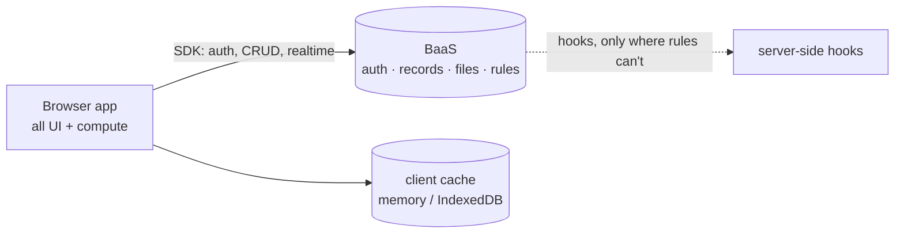

# BaaS + thick client

A rich client app in the browser; a backend-as-a-service (PocketBase-shaped) provides
auth, data, files, and realtime. No custom server code, or almost none.

## Shape

The client does the work: filtering, sorting, aggregation, rendering, derived state. The
BaaS is the source of truth for persistent, shared, or verified state — reached through
its SDK, cached client-side, subscribed to for realtime.

## Trust boundaries

**The collection access rules are the entire security model.** The client is untrusted;
every read and write is authorized per-request by rules (ownership, role, field
protection). Server-side hooks exist only for what rules can't express: side effects,
cross-record invariants, third-party calls. Client-side checks are UX, never security
(`../security.md`, and the rules discipline in `../platforms/pocketbase.md`).

## Fits when / avoid when

- Fits: most apps with accounts — SaaS tools, dashboards, communities, anything CRUD-plus-
  realtime shaped. The default architecture for "an app with users" at indie scale.
- Avoid: heavy concurrent writes (single SQLite writer), multi-region or HA requirements,
  server-side compute that dwarfs CRUD (then you're building a backend, not configuring
  one).

## Cost profile

Flat: one BaaS instance serves the app; client-side compute costs nothing as users grow.
First limits to bite: instance disk (keep large files in object storage) and, on free
hosting, instance sleep / cold starts (`../platforms/pockethost.md`).

## Best practices

- Rules first: every collection gets its five rules before it holds real data, tested by
  calling the API as a stranger (`../testing.md`).
- Pull the dataset the user is entitled to, then compute locally. Round trips for what a
  `filter()` could do is this architecture done wrong.
- Realtime subscriptions over polling — cheaper and fresher. Unsubscribe on unmount.
- Treat the client cache as a cache: server state invalidates it, it never becomes a
  second source of truth (`../types/web-app.md`).
- Migrations committed to the repo; the admin UI is a viewer, not the schema's home.
- Keep hooks thin and synchronous-fast — they run inside every matching request.

## Compatible stacks

`../stacks/default-free-tier.md` (the canonical pairing), `../stacks/alpine-prototype.md`
for the quick version. Clashes with `../stacks/workers-api.md` — that stack exists for
when there is no BaaS.
