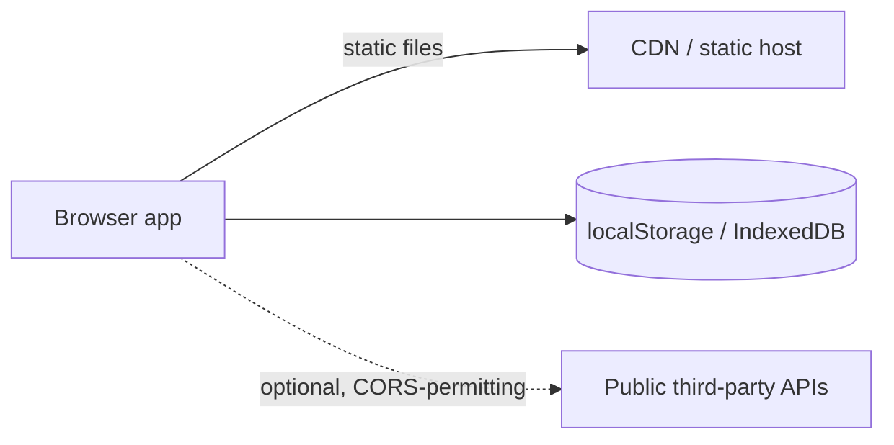

# Client-only

Everything in the browser. No backend, no accounts, no server state.

## Shape

The app is static files. All compute, all state, all persistence live in the user's
browser. The "server" serves bytes and is never trusted with logic.

## Trust boundaries

There is no server-side trust — which is a feature: nothing to secure, nothing to breach,
no PII held. The flip side: nothing can be verified, metered, or kept secret. No API keys
of yours can be involved anywhere (`../security.md`); anything premium or quota'd
disqualifies this architecture on its own.

## Fits when / avoid when

- Fits: calculators, converters, editors, visualizers, generators, single-player tools,
  anything where the user's data is theirs and stays on their device.
- Avoid: accounts, sharing between users, your API keys, anything server-verifiable
  (payments, licenses, quotas), data that must survive a lost device.

## Cost profile

The best there is: static requests are effectively free at any scale. Nothing scales with
users. No limit bites.

## Best practices

- Persist to IndexedDB (via a thin wrapper) for anything beyond trivial size; localStorage
  for small settings only. Version the schema — users return after months.
- Export/import (file download/upload) is the backup story. Build it early; it's also the
  migration path if a backend comes later.
- The URL is the share mechanism: encode state in it where size allows.
- Ship a PWA manifest + service worker if offline use is plausible — this architecture is
  one step from working fully offline.
- Say clearly in the UI that data lives on this device. Users assume clouds.

## Compatible stacks

`../stacks/astro-content.md` (tool embedded in a content site) or the frontend half of any
stack with the backend deleted. Alpine for simple tools; React/Preact/Svelte when state
gets real (`../stacks/`).
