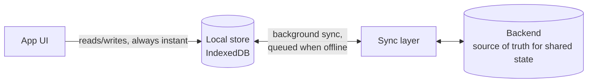

# Local-first + sync

The device's copy is the primary copy. The app reads and writes a local store,
instantly, online or not; a sync layer reconciles with a backend when connectivity
allows.

## Shape

The UI never waits on the network. Writes land locally and queue; sync runs in the
background, pushes the queue, pulls remote changes, and resolves conflicts by a policy
chosen up front.

## Trust boundaries

Same as `baas-client.md` on the server side — rules authorize every synced write; a
malicious client can forge its local store but not what the server accepts. New surface:
the sync layer must tolerate replayed, reordered, and duplicated operations without
corrupting state (idempotent operations, per-record versions or timestamps).

## Fits when / avoid when

- Fits: notes, tasks, journals, field/data-collection tools, anything used on the move or
  where instant interaction is the product. Single-user-per-dataset is the sweet spot.
- Avoid: heavily shared mutable state (conflict resolution becomes the whole project),
  server-verified actions (payments, inventory), teams editing the same records live —
  that needs CRDTs or operational transforms, a deliberate step up in complexity. Don't
  back into it; choose it at the checkpoint or not at all.

## Cost profile

Excellent: reads are local (free), writes batch into sync calls (few), the backend is a
sync target rather than a per-interaction dependency. First limit to bite: none for a long
time — which is much of the appeal (`../stack-and-architecture.md`).

## Best practices

- **Pick the conflict policy at the checkpoint** — last-write-wins per field, merge, or
  surface-to-user — and write it into the decision log. Discovering it later is a rewrite.
- Operation queue, not state snapshots: sync "what changed", idempotent, with client IDs
  so retries don't duplicate.
- Version the local schema and migrate it — users return after months away, offline.
- Show sync state honestly: pending count, last synced, failed items with retry. Silent
  sync failure is data loss with extra steps.
- Every record carries `updated_at` + a device/client id; the server timestamps
  authoritatively on accept.
- Test the ugly paths: offline for a week, sync interrupted mid-batch, same record edited
  on two devices, clock skew (`../testing.md`).

## Compatible stacks

`../stacks/default-free-tier.md` with PocketBase as the sync target (its realtime
subscriptions make decent change feeds). Frontend needs real state discipline —
React/Preact/Svelte over Alpine here.
