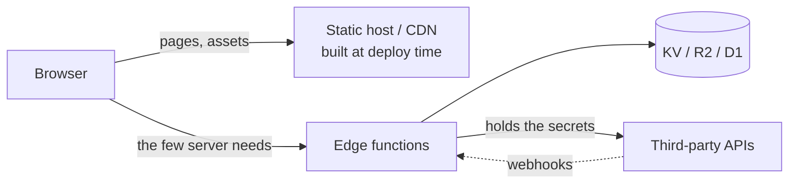

# Static + edge functions

A static site does almost everything; a handful of small serverless functions cover the
few things that genuinely need a server. No always-on backend.

## Shape

Everything renderable at build time is built and served static. Functions exist only for
the five legitimate server jobs: secrets, trust, shared writes, CORS-blocked calls,
webhooks (`../stack-and-architecture.md`).

## Trust boundaries

The static site is public by definition — nothing secret ships in it. Each function is a
narrow trusted gate: it holds a key, verifies a signature, enforces a quota, writes shared
state. Keep each one small enough to audit in one sitting; a function that grew a router
is a backend wearing a costume.

## Fits when / avoid when

- Fits: content sites with a contact form or newsletter signup, tools needing one metered
  API proxied, license/redemption endpoints, webhook receivers, link shorteners, anything
  mostly-static with a thin dynamic edge.
- Avoid: session-based apps with accounts and CRUD (that's `baas-client.md`), long-running
  or stateful work (functions are short-lived and stateless), chatty APIs where per-request
  metering multiplies.

## Cost profile

Static requests effectively free; functions and storage metered per use. First limits to
bite: function invocations/day, then KV writes/day — reads and storage rarely matter
(`../platforms/cloudflare.md`). Cache function responses aggressively; a cache hit skips
the meter.

## Best practices

- Fight for build-time: every page moved from function to build output is cost and latency
  deleted permanently.
- One function, one job, named for it. Shared code in a module, not a mega-function.
- Webhook handlers: verify signatures, respond fast, make them idempotent — senders retry
  (`../security.md`).
- KV is eventually consistent — never use it where read-after-write matters; batch writes.
- Rate-limit anything that sends email or spends money, keyed better than by IP alone.
- Rebuild-on-content-change (CI hook) beats rendering content dynamically.

## Compatible stacks

`../stacks/astro-content.md` (the natural pairing) and `../stacks/workers-api.md` when the
functions side grows into a small service. Composes with `client-only.md` — a client-only
tool often gains its first function here.
